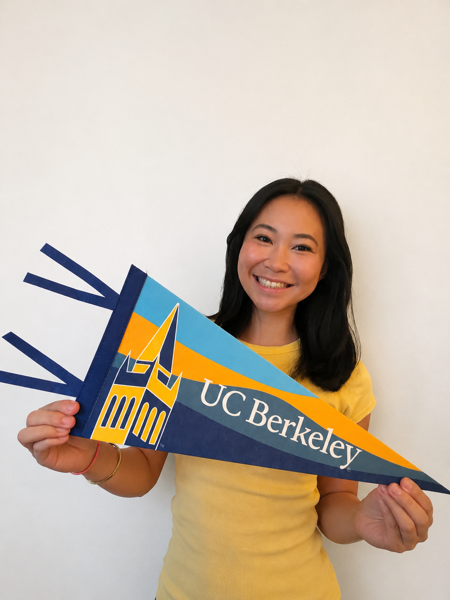

# alisasonehara.github.io
[index.html](https://github.com/user-attachments/files/29170456/index.html)
<!DOCTYPE html>
<html lang="en">
<head>
  <meta charset="UTF-8" />
  <meta name="viewport" content="width=device-width, initial-scale=1.0" />
  <title>Sonehara Consulting — For the Unconventional Student</title>
  <link rel="preconnect" href="https://fonts.googleapis.com" />
  <link rel="preconnect" href="https://fonts.gstatic.com" crossorigin />
  <link href="https://fonts.googleapis.com/css2?family=Playfair+Display:ital,wght@0,400;0,600;0,700;1,400;1,600&family=DM+Sans:wght@300;400;500&display=swap" rel="stylesheet" />
  <link rel="stylesheet" href="style.css" />
</head>
<body>

  <!-- NAV -->
  <nav class="nav">
    

      Sonehara Consulting 
      for the unconventional student
    

    <a href="book.html" class="btn btn-outline">Book a Session</a>
  </nav>

  <!-- HERO -->
  <section class="hero">
    

      
    

    

      
a new consulting paradigm

      <h1>Sonehara Consulting for the Unconventional Student</h1>
      
To empower students to design their own path to success by identifying unconventional opportunities, crafting authentic application narratives, and developing real-world experiences that help them stand out beyond traditional credentials.

      <a href="book.html" class="btn btn-primary">Book a Session</a>
    

  </section>

  <!-- MARQUEE -->
  

    

      ★ UC BERKELEY HAAS
      ★ GLOBAL MANAGEMENT
      ★ CONSULTING
      ★ UC BERKELEY HAAS
      ★ GLOBAL MANAGEMENT
      ★ CONSULTING
      ★ UC BERKELEY HAAS
      ★ GLOBAL MANAGEMENT
      ★ CONSULTING
      ★ UC BERKELEY HAAS
      ★ GLOBAL MANAGEMENT
      ★ CONSULTING
    

  

  <!-- CREDIBILITY -->
  <section class="credibility">
    
A DIFFERENT KIND OF STORY

    <h2 class="cred-headline">I got into a #1 public undergraduate business program in the world.</h2>
    

      <svg class="squiggle" viewBox="0 0 80 20" fill="none" xmlns="http://www.w3.org/2000/svg">
        <path d="M4 10 Q14 2 24 10 Q34 18 44 10 Q54 2 64 10 Q74 18 84 10" stroke="#C4522A" stroke-width="2" fill="none"/>
      </svg>
      

        #1 public undergraduate business program in the world.
      

      <svg class="squiggle flip" viewBox="0 0 80 20" fill="none" xmlns="http://www.w3.org/2000/svg">
        <path d="M4 10 Q14 2 24 10 Q34 18 44 10 Q54 2 64 10 Q74 18 84 10" stroke="#C4522A" stroke-width="2" fill="none"/>
      </svg>
    

    
Your Path. Your Story. Your Future.

  </section>

  <!-- STATS CARDS -->
  <section class="stats">
    

      
HOW I DID IT DIFFERENTLY

      <h2>The strongest stories are rarely the most obvious ones.</h2>
      
because "different" can be your edge.

    

    

      

        

          <svg width="32" height="32" viewBox="0 0 32 32" fill="none">
            <rect x="6" y="4" width="20" height="24" rx="2" stroke="#C4522A" stroke-width="1.5"/>
            <line x1="10" y1="10" x2="22" y2="10" stroke="#C4522A" stroke-width="1.5"/>
            <line x1="10" y1="14" x2="22" y2="14" stroke="#C4522A" stroke-width="1.5"/>
            <line x1="10" y1="18" x2="16" y2="18" stroke="#C4522A" stroke-width="1.5"/>
            <line x1="8" y1="6" x2="24" y2="28" stroke="#C4522A" stroke-width="1.5"/>
          </svg>
        

        <h3>0 AP Classes</h3>
        
I never took a single AP course.

      

      

        

          <svg width="32" height="32" viewBox="0 0 32 32" fill="none">
            <rect x="4" y="6" width="24" height="18" rx="2" stroke="#C4522A" stroke-width="1.5"/>
            <line x1="4" y1="12" x2="28" y2="12" stroke="#C4522A" stroke-width="1.5"/>
            <line x1="9" y1="17" x2="13" y2="17" stroke="#C4522A" stroke-width="1.5"/>
            <line x1="8" y1="8" x2="24" y2="24" stroke="#C4522A" stroke-width="1.5"/>
          </svg>
        

        <h3>No SAT</h3>
        
Standardized tests weren't part of my path.

      

      

        

          <svg width="32" height="32" viewBox="0 0 32 32" fill="none">
            <rect x="9" y="13" width="14" height="13" stroke="#C4522A" stroke-width="1.5"/>
            <path d="M5 13 L16 5 L27 13" stroke="#C4522A" stroke-width="1.5" stroke-linejoin="round"/>
            <rect x="13" y="20" width="6" height="6" stroke="#C4522A" stroke-width="1.5"/>
            <rect x="10" y="15" width="4" height="4" stroke="#C4522A" stroke-width="1.5"/>
            <rect x="18" y="15" width="4" height="4" stroke="#C4522A" stroke-width="1.5"/>
            <line x1="16" y1="2" x2="16" y2="5" stroke="#C4522A" stroke-width="1.5"/>
            <polygon points="16,1 19,3 16,5 13,3" fill="#C4522A"/>
          </svg>
        

        <h3>Middle College Pathway</h3>
        
I took an unconventional route through dual enrollment at a community college.

        <a href="middle-college.html" class="btn btn-primary card-btn">Learn More</a>
      

    

  </section>

  <!-- WHO AM I -->
  <section class="about">
    

      
    

    

      
WHO AM I

      <h2>Hi, I'm Alisa.</h2>
      
I'm a first-generation Japanese American immigrant who grew up in the Bay Area. I started at Gunn High School and transferred to Palo Alto Middle College for my junior and senior year, a decision that changed everything.

      
My first two years of high school weren't my strongest academically. But I'm someone who's deeply self-motivated, and I knew I had more to offer than my GPA was showing. So I took a risk, changed my environment, and built myself up from there.

      
Outside of school, you'll find me hunting down the best coffee spots, doing a froyo run, planning my next trip, or putting together an outfit. I love connecting with people and stepping into spaces that make me a little uncomfortable — because that's usually where the growth is.

    

  </section>

  <!-- EXPERIENCE GRID -->
  <section class="experience">
    

      
HOW I BECAME A WELL-ROUNDED APPLICANT

      <h2>It wasn't one thing. It was everything.</h2>
      
I built my application through real experiences across a lot of different areas. Here's a glimpse at what that looked like.

    

    

      <!-- Community Involvement -->
      

        

          <svg width="28" height="28" viewBox="0 0 28 28" fill="none">
            <circle cx="14" cy="14" r="10" stroke="#C4522A" stroke-width="1.5"/>
            <path d="M14 4 C14 4 10 9 10 14 C10 19 14 24 14 24" stroke="#C4522A" stroke-width="1.5"/>
            <path d="M14 4 C14 4 18 9 18 14 C18 19 14 24 14 24" stroke="#C4522A" stroke-width="1.5"/>
            <line x1="4" y1="14" x2="24" y2="14" stroke="#C4522A" stroke-width="1.5"/>
          </svg>
        

        <h4>Community Involvement</h4>
        
Showed up for the communities around me, not just my own resume.

      

      <!-- Leadership: person raising arm -->
      

        

          <svg width="28" height="28" viewBox="0 0 28 28" fill="none">
            <circle cx="14" cy="6" r="3" stroke="#C4522A" stroke-width="1.5"/>
            <line x1="14" y1="9" x2="14" y2="18" stroke="#C4522A" stroke-width="1.5"/>
            <line x1="14" y1="13" x2="8" y2="9" stroke="#C4522A" stroke-width="1.5"/>
            <line x1="14" y1="13" x2="21" y2="7" stroke="#C4522A" stroke-width="1.5"/>
            <line x1="14" y1="18" x2="10" y2="24" stroke="#C4522A" stroke-width="1.5"/>
            <line x1="14" y1="18" x2="18" y2="24" stroke="#C4522A" stroke-width="1.5"/>
          </svg>
        

        <h4>Leadership</h4>
        
I didn't just find leadership roles. I built them.

      

      <!-- Cultural Involvement: Japan flag -->
      

        

          <svg width="28" height="28" viewBox="0 0 28 28" fill="none">
            <rect x="3" y="6" width="22" height="16" rx="1" stroke="#C4522A" stroke-width="1.5" fill="white"/>
            <circle cx="14" cy="14" r="4.5" fill="#C4522A"/>
          </svg>
        

        <h4>Cultural Involvement</h4>
        
Stayed connected to my Japanese American heritage and used it to build bridges.

      

      <!-- School Rep: grad cap -->
      

        

          <svg width="28" height="28" viewBox="0 0 28 28" fill="none">
            <polygon points="14,5 26,11 14,17 2,11" stroke="#C4522A" stroke-width="1.5" fill="none" stroke-linejoin="round"/>
            <path d="M22 13.5 L22 20 C22 20 18 23 14 23 C10 23 6 20 6 20 L6 13.5" stroke="#C4522A" stroke-width="1.5" stroke-linejoin="round"/>
            <line x1="26" y1="11" x2="26" y2="18" stroke="#C4522A" stroke-width="1.5"/>
            <circle cx="26" cy="19" r="1.5" fill="#C4522A"/>
          </svg>
        

        <h4>School Representation</h4>
        
Represented my school in settings that mattered beyond the classroom.

      

      <!-- TEDx: stage/mic -->
      

        

          <svg width="28" height="28" viewBox="0 0 28 28" fill="none">
            <rect x="2" y="18" width="24" height="3" rx="1" stroke="#C4522A" stroke-width="1.5"/>
            <rect x="6" y="14" width="16" height="4" rx="0" stroke="#C4522A" stroke-width="1.5"/>
            <circle cx="14" cy="9" r="3" stroke="#C4522A" stroke-width="1.5"/>
            <line x1="14" y1="12" x2="14" y2="14" stroke="#C4522A" stroke-width="1.5"/>
            <path d="M11 9 Q11 6 14 6 Q17 6 17 9" stroke="#C4522A" stroke-width="1.5" fill="none"/>
            <line x1="9" y1="18" x2="7" y2="21" stroke="#C4522A" stroke-width="1.5"/>
            <line x1="19" y1="18" x2="21" y2="21" stroke="#C4522A" stroke-width="1.5"/>
          </svg>
        

        <h4>TEDx</h4>
        
Took the stage to share ideas worth spreading.

      

      <!-- Business Competitions -->
      

        

          <svg width="28" height="28" viewBox="0 0 28 28" fill="none">
            <rect x="3" y="3" width="22" height="22" rx="2" stroke="#C4522A" stroke-width="1.5"/>
            <polyline points="6,19 10,13 14,16 18,9 22,12" stroke="#C4522A" stroke-width="1.5" fill="none"/>
          </svg>
        

        <h4>Business Competitions</h4>
        
Competed and learned how to think on my feet under pressure.

      

      <!-- Research: open book -->
      

        

          <svg width="28" height="28" viewBox="0 0 28 28" fill="none">
            <path d="M14 22 L14 8" stroke="#C4522A" stroke-width="1.5"/>
            <path d="M14 8 C14 8 10 6 4 7 L4 22 C10 21 14 22 14 22" stroke="#C4522A" stroke-width="1.5" stroke-linejoin="round"/>
            <path d="M14 8 C14 8 18 6 24 7 L24 22 C18 21 14 22 14 22" stroke="#C4522A" stroke-width="1.5" stroke-linejoin="round"/>
          </svg>
        

        <h4>Research</h4>
        
Researched topics that align with my passions and contribute to the community.

      

      <!-- Work Experience: coins -->
      

        

          <svg width="28" height="28" viewBox="0 0 28 28" fill="none">
            <ellipse cx="14" cy="8" rx="8" ry="3" stroke="#C4522A" stroke-width="1.5"/>
            <path d="M6 8 L6 13" stroke="#C4522A" stroke-width="1.5"/>
            <path d="M22 8 L22 13" stroke="#C4522A" stroke-width="1.5"/>
            <ellipse cx="14" cy="13" rx="8" ry="3" stroke="#C4522A" stroke-width="1.5"/>
            <path d="M6 13 L6 18" stroke="#C4522A" stroke-width="1.5"/>
            <path d="M22 13 L22 18" stroke="#C4522A" stroke-width="1.5"/>
            <ellipse cx="14" cy="18" rx="8" ry="3" stroke="#C4522A" stroke-width="1.5"/>
          </svg>
        

        <h4>Work Experience</h4>
        
Got real-life experience early and learned what it means to serve and make an impact.

      

      <!-- Internship: camera/tv -->
      

        

          <svg width="28" height="28" viewBox="0 0 28 28" fill="none">
            <rect x="3" y="8" width="17" height="12" rx="2" stroke="#C4522A" stroke-width="1.5"/>
            <path d="M20 12 L25 9 L25 19 L20 16" stroke="#C4522A" stroke-width="1.5" stroke-linejoin="round"/>
            <circle cx="10" cy="14" r="2.5" stroke="#C4522A" stroke-width="1.5"/>
          </svg>
        

        <h4>Internships</h4>
        
Gained hands-on experience, expanded my knowledge, and made a real impact.

      

      <!-- Sports + Marathon: running shoe -->
      

        

          <svg width="28" height="28" viewBox="0 0 28 28" fill="none" xmlns="http://www.w3.org/2000/svg">
            <!-- sole -->
            <path d="M2 20 Q2 23 6 23 L22 23 Q26 23 26 20 L26 19 L2 19 Z" fill="#C4522A"/>
            <!-- upper shoe body -->
            <path d="M2 19 L2 14 Q2 11 5 10 L10 9 L13 6 Q14 5 16 6 L16 9 L20 9 Q24 9 25 13 L26 19 Z" fill="#C4522A"/>
            <!-- lace highlight lines -->
            <line x1="10" y1="10" x2="10" y2="14" stroke="white" stroke-width="1" stroke-linecap="round"/>
            <line x1="13" y1="9.5" x2="13" y2="14" stroke="white" stroke-width="1" stroke-linecap="round"/>
            <line x1="16" y1="9.5" x2="16" y2="14" stroke="white" stroke-width="1" stroke-linecap="round"/>
            <line x1="9" y1="14" x2="17" y2="14" stroke="white" stroke-width="1" stroke-linecap="round"/>
          </svg>
        

        <h4>Sports + Marathon</h4>
        
Pushed my physical and mental limits to learn what it means to commit.

      

      <!-- Creative: paint palette -->
      

        

          <svg width="28" height="28" viewBox="0 0 28 28" fill="none">
            <path d="M14 4 C8 4 4 8 4 13 C4 18 7 21 11 22 C13 22.5 14 21 14 19 C14 17.5 15 17 16 17 C20 17 24 15 24 11 C24 7 19.5 4 14 4 Z" stroke="#C4522A" stroke-width="1.5" fill="none"/>
            <circle cx="9" cy="10" r="1.5" fill="#C4522A"/>
            <circle cx="14" cy="7" r="1.5" fill="#C4522A"/>
            <circle cx="19" cy="10" r="1.5" fill="#C4522A"/>
            <circle cx="20" cy="15" r="1.5" fill="#C4522A"/>
          </svg>
        

        <h4>Creative</h4>
        
Art shows, presentations, and projects that let me express a different side.

      

    

  </section>

  <!-- CTA -->
  <section class="cta-section">
    
★

    <h2>Ready to build your story?</h2>
    
Book a 1-on-1 session for college applications, scholarship essays, or mapping out your path.

    <a href="book.html" class="btn btn-primary">Book Your Session →</a>
  </section>

  <!-- EMAIL SIGNUP -->
  <section class="signup">
    
STAY IN THE KNOW

    <h2>Stay in the loop.</h2>
    
Sign up to hear about upcoming seminars, Q&amp;As, workshops, and tips for standing out in your college journey.

    <form class="signup-form" action="https://formspree.io/f/YOUR_FORM_ID" method="POST">
      <input type="email" name="email" placeholder="Your email address" required />
      <button type="submit" class="btn btn-primary">Sign Me Up</button>
    </form>
    
No spam, ever. Unsubscribe anytime.

  </section>

  <!-- CONNECT -->
  <section class="connect">
    
CONNECT WITH ME

    <h2>Find me online</h2>
    

      <a href="https://www.instagram.com/alisa.soph" target="_blank" rel="noopener" class="social-card">
        <svg width="28" height="28" viewBox="0 0 28 28" fill="none">
          <rect x="4" y="4" width="20" height="20" rx="6" stroke="currentColor" stroke-width="1.5"/>
          <circle cx="14" cy="14" r="5" stroke="currentColor" stroke-width="1.5"/>
          <circle cx="20" cy="8" r="1.2" fill="currentColor"/>
        </svg>
        Instagram
        @alisa.soph
      </a>
      <a href="https://www.tiktok.com/@alisa.soph" target="_blank" rel="noopener" class="social-card">
        <svg width="28" height="28" viewBox="0 0 28 28" fill="none">
          <path d="M18 4 C18 4 18.5 8 22 9.5" stroke="currentColor" stroke-width="1.5" stroke-linecap="round"/>
          <path d="M18 4 L18 18 C18 21 16 23 13 23 C10 23 8 21 8 18 C8 15 10 13 13 13 C13.7 13 14.4 13.1 15 13.4" stroke="currentColor" stroke-width="1.5" stroke-linecap="round"/>
        </svg>
        TikTok
        @alisa.soph
      </a>
      <a href="https://www.youtube.com/@AlisaSonehara" target="_blank" rel="noopener" class="social-card">
        <svg width="28" height="28" viewBox="0 0 28 28" fill="none">
          <rect x="3" y="7" width="22" height="14" rx="4" stroke="currentColor" stroke-width="1.5"/>
          <polygon points="12,10 12,18 20,14" fill="currentColor"/>
        </svg>
        YouTube
        @AlisaSonehara
      </a>
    

  </section>

  <!-- FOOTER -->
  <footer class="footer">
    © Sonehara Consulting
    Questions? <a href="mailto:alisassonehara@gmail.com">alisassonehara@gmail.com</a>
    <nav class="footer-links">
      <a href="index.html">Your Path</a>
      <a href="book.html">Your Story</a>
      <a href="book.html">Book a Session</a>
    </nav>
  </footer>

</body>
</html>
[style.css](https://github.com/user-attachments/files/29170457/style.css)
/* ============================================
   SONEHARA CONSULTING — GLOBAL STYLES
   ============================================ */

*, *::before, *::after { box-sizing: border-box; margin: 0; padding: 0; }

:root {
  --cream: #F5F0E8;
  --cream-dark: #EDE7D9;
  --terracotta: #C4522A;
  --terracotta-dark: #9E3E1C;
  --charcoal: #2C2C2A;
  --charcoal-light: #5A5A56;
  --yellow-card: #F5E6A3;
  --yellow-card-dark: #EDD96A;
  --sage: #8A9E8A;
  --sage-light: #C8D8C2;
  --off-white: #FAF8F3;
  --stripe-blue: #B8CBE4;
}

html { scroll-behavior: smooth; }

body {
  font-family: 'DM Sans', sans-serif;
  background-color: var(--cream);
  color: var(--charcoal);
  font-size: 16px;
  line-height: 1.6;
}

h1, h2, h3 {
  font-family: 'Playfair Display', serif;
  line-height: 1.2;
}

a { text-decoration: none; color: inherit; }

img { display: block; width: 100%; height: 100%; object-fit: cover; }

/* ============================================
   BUTTONS
   ============================================ */

.btn {
  display: inline-block;
  padding: 12px 28px;
  border-radius: 100px;
  font-family: 'DM Sans', sans-serif;
  font-size: 14px;
  font-weight: 500;
  cursor: pointer;
  transition: all 0.2s ease;
  border: none;
  letter-spacing: 0.02em;
}

.btn-primary {
  background: var(--terracotta);
  color: #fff;
}
.btn-primary:hover { background: var(--terracotta-dark); transform: translateY(-1px); }

.btn-outline {
  background: transparent;
  color: var(--terracotta);
  border: 1.5px solid var(--terracotta);
}
.btn-outline:hover { background: var(--terracotta); color: #fff; }

/* ============================================
   NAV
   ============================================ */

.nav {
  display: flex;
  align-items: center;
  justify-content: space-between;
  padding: 18px 48px;
  background: var(--cream);
  border-bottom: 1px solid rgba(0,0,0,0.08);
  position: sticky;
  top: 0;
  z-index: 100;
}

.nav-brand {
  font-family: 'Playfair Display', serif;
  font-size: 15px;
  font-weight: 600;
  color: var(--charcoal);
  line-height: 1.3;
}

.nav-sub {
  font-family: 'DM Sans', sans-serif;
  font-size: 11px;
  font-weight: 300;
  color: var(--charcoal-light);
  display: block;
  letter-spacing: 0.04em;
}

/* ============================================
   HERO
   ============================================ */

.hero {
  display: grid;
  grid-template-columns: 1fr 1fr;
  min-height: 520px;
}

.hero-photo {
  overflow: hidden;
  background: var(--cream-dark);
  min-height: 480px;
}

.hero-photo img {
  width: 100%;
  height: 100%;
  object-fit: cover;
  object-position: top center;
}

.hero-content {
  padding: 60px 56px 60px 52px;
  background-image: repeating-linear-gradient(
    90deg,
    transparent,
    transparent 18px,
    var(--stripe-blue) 18px,
    var(--stripe-blue) 20px
  );
  display: flex;
  flex-direction: column;
  justify-content: center;
  gap: 20px;
}

.hero-content h1 {
  font-size: clamp(24px, 3vw, 36px);
  font-weight: 700;
  color: var(--charcoal);
}

.hero-body {
  font-size: 14px;
  color: var(--charcoal-light);
  line-height: 1.7;
  max-width: 400px;
}

/* ============================================
   EYEBROWS & LABELS
   ============================================ */

.eyebrow-label {
  font-family: 'DM Sans', sans-serif;
  font-size: 11px;
  font-weight: 500;
  letter-spacing: 0.12em;
  color: var(--charcoal-light);
  text-transform: uppercase;
}

.eyebrow-italic {
  font-family: 'Playfair Display', serif;
  font-style: italic;
  font-size: 14px;
  color: var(--charcoal-light);
}

/* ============================================
   MARQUEE
   ============================================ */

.marquee-bar {
  background: var(--terracotta);
  overflow: hidden;
  padding: 12px 0;
  white-space: nowrap;
}

.marquee-track {
  display: inline-flex;
  gap: 40px;
  animation: marquee 22s linear infinite;
}

.marquee-track span {
  font-family: 'DM Sans', sans-serif;
  font-size: 12px;
  font-weight: 500;
  letter-spacing: 0.1em;
  color: #fff;
}

@keyframes marquee {
  from { transform: translateX(0); }
  to { transform: translateX(-50%); }
}

/* ============================================
   CREDIBILITY
   ============================================ */

.credibility {
  background: var(--off-white);
  padding: 80px 48px;
  text-align: center;
  display: flex;
  flex-direction: column;
  align-items: center;
  gap: 24px;
}

.cred-headline {
  font-size: clamp(22px, 3vw, 32px);
  font-weight: 600;
  color: var(--charcoal);
  max-width: 600px;
}

.cred-squiggle-row {
  display: flex;
  align-items: center;
  gap: 20px;
  flex-wrap: wrap;
  justify-content: center;
}

.squiggle {
  width: 80px;
  height: 20px;
  flex-shrink: 0;
}
.squiggle.flip { transform: scaleX(-1); }

.cred-box {
  border: 1.5px dashed var(--terracotta);
  padding: 16px 32px;
  border-radius: 4px;
  font-family: 'Playfair Display', serif;
  font-size: clamp(15px, 2vw, 20px);
  font-weight: 600;
  color: var(--charcoal);
  max-width: 480px;
}

.catchphrase {
  font-family: 'Playfair Display', serif;
  font-style: italic;
  font-size: clamp(18px, 2.5vw, 26px);
  color: var(--terracotta);
  font-weight: 400;
}

/* ============================================
   STATS / CARDS
   ============================================ */

.stats {
  background: var(--yellow-card);
  padding: 72px 48px;
}

.stats-header {
  text-align: center;
  margin-bottom: 48px;
  display: flex;
  flex-direction: column;
  gap: 12px;
}

.stats-header h2 {
  font-size: clamp(20px, 2.5vw, 28px);
  font-weight: 600;
  color: var(--charcoal);
}

.stats-sub {
  font-size: 13px;
  color: var(--charcoal-light);
  font-style: italic;
}

.cards-row {
  display: grid;
  grid-template-columns: repeat(3, 1fr);
  gap: 24px;
  max-width: 960px;
  margin: 0 auto;
}

.card {
  background: var(--cream);
  border-radius: 12px;
  padding: 32px 28px;
  display: flex;
  flex-direction: column;
  gap: 12px;
  border: 1px solid rgba(0,0,0,0.06);
}

.card-icon {
  margin-bottom: 4px;
}

.card h3 {
  font-size: 20px;
  font-weight: 600;
  color: var(--charcoal);
}

.card p {
  font-size: 14px;
  color: var(--charcoal-light);
  line-height: 1.6;
  flex: 1;
}

.card-btn {
  margin-top: 8px;
  align-self: flex-start;
  font-size: 13px;
  padding: 10px 22px;
}

/* ============================================
   CTA SECTION
   ============================================ */

.cta-section {
  background: var(--off-white);
  padding: 80px 48px;
  text-align: center;
  display: flex;
  flex-direction: column;
  align-items: center;
  gap: 16px;
}

.star-icon {
  font-size: 24px;
  color: var(--terracotta);
  margin-bottom: 4px;
}

.cta-section h2 {
  font-size: clamp(24px, 3vw, 36px);
  font-weight: 700;
  color: var(--charcoal);
}

.cta-section p {
  font-size: 15px;
  color: var(--charcoal-light);
  margin-bottom: 8px;
}

/* ============================================
   EMAIL SIGNUP
   ============================================ */

.signup {
  background: var(--sage-light);
  padding: 72px 48px;
  text-align: center;
  display: flex;
  flex-direction: column;
  align-items: center;
  gap: 14px;
}

.signup h2 {
  font-size: clamp(24px, 3vw, 36px);
  font-weight: 700;
  color: var(--charcoal);
}

.signup-sub {
  font-size: 14px;
  color: var(--charcoal-light);
  max-width: 480px;
}

.signup-form {
  display: flex;
  gap: 12px;
  flex-wrap: wrap;
  justify-content: center;
  margin-top: 8px;
  width: 100%;
  max-width: 540px;
}

.signup-form input[type="email"] {
  flex: 1;
  min-width: 220px;
  padding: 12px 20px;
  border-radius: 100px;
  border: 1.5px solid rgba(0,0,0,0.12);
  background: #fff;
  font-family: 'DM Sans', sans-serif;
  font-size: 14px;
  color: var(--charcoal);
  outline: none;
  transition: border-color 0.2s;
}
.signup-form input[type="email"]:focus { border-color: var(--terracotta); }

.signup-note {
  font-size: 12px;
  color: var(--charcoal-light);
}

/* ============================================
   FOOTER
   ============================================ */

.footer {
  background: var(--charcoal);
  color: rgba(255,255,255,0.6);
  padding: 28px 48px;
  display: flex;
  align-items: center;
  justify-content: space-between;
  flex-wrap: wrap;
  gap: 16px;
  font-size: 13px;
}

.footer-links {
  display: flex;
  gap: 28px;
}

.footer-links a {
  color: rgba(255,255,255,0.6);
  transition: color 0.2s;
}
.footer-links a:hover { color: #fff; }

/* ============================================
   PAGE HEADER (inner pages)
   ============================================ */

.page-header {
  background: var(--terracotta);
  padding: 60px 48px 48px;
  color: #fff;
}

.page-header .eyebrow-label { color: rgba(255,255,255,0.7); }
.page-header h1 { font-size: clamp(28px, 4vw, 48px); color: #fff; margin-top: 12px; }
.page-header p { font-size: 16px; color: rgba(255,255,255,0.85); margin-top: 12px; max-width: 600px; }

/* ============================================
   BOOK PAGE
   ============================================ */

.book-section {
  padding: 64px 48px;
  max-width: 900px;
  margin: 0 auto;
}

.book-section h2 {
  font-size: 24px;
  margin-bottom: 32px;
  color: var(--charcoal);
}

.calendar-embed {
  background: var(--off-white);
  border: 1px solid rgba(0,0,0,0.08);
  border-radius: 16px;
  padding: 48px;
  text-align: center;
  margin-bottom: 48px;
  min-height: 400px;
  display: flex;
  align-items: center;
  justify-content: center;
}

.calendar-embed p {
  color: var(--charcoal-light);
  font-size: 14px;
}

/* Replace the above with your Calendly embed:
   

   
*/

.intake-form {
  display: flex;
  flex-direction: column;
  gap: 24px;
}

.form-group {
  display: flex;
  flex-direction: column;
  gap: 8px;
}

.form-group label {
  font-size: 14px;
  font-weight: 500;
  color: var(--charcoal);
}

.form-group select,
.form-group textarea {
  padding: 12px 16px;
  border-radius: 10px;
  border: 1.5px solid rgba(0,0,0,0.12);
  background: #fff;
  font-family: 'DM Sans', sans-serif;
  font-size: 14px;
  color: var(--charcoal);
  outline: none;
  transition: border-color 0.2s;
  appearance: none;
  width: 100%;
}

.form-group select:focus,
.form-group textarea:focus { border-color: var(--terracotta); }

.form-group textarea { resize: vertical; min-height: 120px; }

.intake-form .btn-primary {
  align-self: flex-start;
  padding: 14px 36px;
  font-size: 15px;
}

/* ============================================
   MIDDLE COLLEGE PAGE
   ============================================ */

.mc-section {
  padding: 64px 48px;
  max-width: 800px;
  margin: 0 auto;
}

.mc-section p {
  font-size: 16px;
  color: var(--charcoal-light);
  line-height: 1.8;
  margin-bottom: 20px;
}

.mc-section h2 {
  font-size: 26px;
  color: var(--charcoal);
  margin: 40px 0 16px;
}

.mc-callout {
  background: var(--yellow-card);
  border-left: 4px solid var(--terracotta);
  padding: 24px 28px;
  border-radius: 0 12px 12px 0;
  margin: 32px 0;
}

.mc-callout p {
  font-family: 'Playfair Display', serif;
  font-size: 18px;
  font-style: italic;
  color: var(--charcoal);
  margin: 0;
}

.mc-cta {
  background: var(--off-white);
  border-radius: 16px;
  padding: 48px;
  text-align: center;
  margin-top: 48px;
  display: flex;
  flex-direction: column;
  align-items: center;
  gap: 16px;
}

.mc-cta h2 { font-size: 26px; color: var(--charcoal); }
.mc-cta p { font-size: 15px; color: var(--charcoal-light); }

/* ============================================
   RESPONSIVE
   ============================================ */

@media (max-width: 768px) {
  .nav { padding: 16px 24px; }
  .hero { grid-template-columns: 1fr; }
  .hero-photo { min-height: 340px; }
  .hero-content { padding: 40px 28px; }
  .credibility { padding: 56px 24px; }
  .cred-squiggle-row { gap: 12px; }
  .stats { padding: 56px 24px; }
  .cards-row { grid-template-columns: 1fr; }
  .cta-section { padding: 56px 24px; }
  .signup { padding: 56px 24px; }
  .footer { padding: 24px; flex-direction: column; text-align: center; }
  .book-section, .mc-section { padding: 40px 24px; }
  .page-header { padding: 48px 24px 36px; }
  .calendar-embed { padding: 32px 20px; }
  .mc-cta { padding: 36px 24px; }
}

/* ============================================
   ABOUT / WHO AM I
   ============================================ */

.about {
  display: grid;
  grid-template-columns: 1fr 1.4fr;
  min-height: 480px;
  background: var(--cream);
}

.about-photo {
  overflow: hidden;
  background: var(--cream-dark);
}

.about-photo img {
  width: 100%;
  height: 100%;
  object-fit: cover;
  object-position: top center;
}

.about-content {
  padding: 64px 56px;
  display: flex;
  flex-direction: column;
  justify-content: center;
  gap: 16px;
}

.about-content h2 {
  font-size: clamp(28px, 3.5vw, 42px);
  font-weight: 700;
  color: var(--charcoal);
}

.about-content p {
  font-size: 15px;
  color: var(--charcoal-light);
  line-height: 1.8;
}

.about-tags {
  display: flex;
  flex-wrap: wrap;
  gap: 10px;
  margin-top: 8px;
}

.tag {
  background: var(--cream-dark);
  color: var(--charcoal);
  font-size: 13px;
  font-weight: 500;
  padding: 6px 14px;
  border-radius: 100px;
  border: 1px solid rgba(0,0,0,0.08);
}

/* ============================================
   EXPERIENCE GRID
   ============================================ */

.experience {
  background: var(--off-white);
  padding: 80px 48px;
}

.experience-header {
  text-align: center;
  max-width: 640px;
  margin: 0 auto 52px;
  display: flex;
  flex-direction: column;
  gap: 12px;
}

.experience-header h2 {
  font-size: clamp(22px, 3vw, 32px);
  font-weight: 700;
  color: var(--charcoal);
}

.experience-sub {
  font-size: 14px;
  color: var(--charcoal-light);
  line-height: 1.7;
}

.exp-grid {
  display: grid;
  grid-template-columns: repeat(auto-fit, minmax(200px, 1fr));
  gap: 20px;
  max-width: 1100px;
  margin: 0 auto;
}

.exp-card {
  background: var(--cream);
  border-radius: 14px;
  padding: 28px 24px;
  display: flex;
  flex-direction: column;
  gap: 10px;
  border: 1px solid rgba(0,0,0,0.06);
  transition: transform 0.2s ease, box-shadow 0.2s ease;
}

.exp-card:hover {
  transform: translateY(-3px);
  box-shadow: 0 8px 24px rgba(0,0,0,0.07);
}

.exp-card-highlight {
  border: 1.5px solid var(--terracotta);
  background: #fff8f5;
}

.exp-icon {
  margin-bottom: 4px;
}

.exp-card h4 {
  font-family: 'Playfair Display', serif;
  font-size: 16px;
  font-weight: 600;
  color: var(--charcoal);
}

.exp-card p {
  font-size: 13px;
  color: var(--charcoal-light);
  line-height: 1.6;
}

/* ============================================
   CONNECT / SOCIAL
   ============================================ */

.connect {
  background: var(--cream-dark);
  padding: 72px 48px;
  text-align: center;
  display: flex;
  flex-direction: column;
  align-items: center;
  gap: 16px;
}

.connect h2 {
  font-size: clamp(24px, 3vw, 36px);
  font-weight: 700;
  color: var(--charcoal);
}

.social-row {
  display: flex;
  gap: 20px;
  flex-wrap: wrap;
  justify-content: center;
  margin-top: 12px;
}

.social-card {
  background: var(--cream);
  border: 1px solid rgba(0,0,0,0.08);
  border-radius: 16px;
  padding: 28px 36px;
  display: flex;
  flex-direction: column;
  align-items: center;
  gap: 8px;
  color: var(--charcoal);
  transition: all 0.2s ease;
  min-width: 160px;
  text-decoration: none;
}

.social-card:hover {
  border-color: var(--terracotta);
  color: var(--terracotta);
  transform: translateY(-2px);
}

.social-name {
  font-size: 15px;
  font-weight: 500;
  margin-top: 4px;
}

.social-handle {
  font-size: 13px;
  color: var(--charcoal-light);
}

.social-card:hover .social-handle {
  color: var(--terracotta);
}

/* ============================================
   FOOTER UPDATE (contact line)
   ============================================ */

.footer-contact {
  font-size: 13px;
  color: rgba(255,255,255,0.6);
}

.footer-contact a {
  color: rgba(255,255,255,0.85);
  text-decoration: underline;
  transition: color 0.2s;
}

.footer-contact a:hover { color: #fff; }

/* ============================================
   RESPONSIVE ADDITIONS
   ============================================ */

@media (max-width: 768px) {
  .about { grid-template-columns: 1fr; }
  .about-photo { min-height: 300px; }
  .about-content { padding: 40px 24px; }
  .experience { padding: 56px 24px; }
  .exp-grid { grid-template-columns: 1fr 1fr; }
  .connect { padding: 56px 24px; }
  .social-row { gap: 14px; }
  .social-card { min-width: 140px; padding: 22px 24px; }
}

@media (max-width: 480px) {
  .exp-grid { grid-template-columns: 1fr; }
  .social-row { flex-direction: column; align-items: center; }
}

/* ============================================
   HERO PHOTO CENTERING
   ============================================ */

.hero-photo img {
  object-position: center top;
}

/* ============================================
   PRICING BANNER
   ============================================ */

.pricing-banner {
  background: var(--cream-dark);
  border-bottom: 1px solid rgba(0,0,0,0.07);
  padding: 28px 48px;
}

.pricing-inner {
  max-width: 900px;
  margin: 0 auto;
  display: flex;
  align-items: flex-start;
  gap: 32px;
  flex-wrap: wrap;
}

.pricing-item {
  display: flex;
  flex-direction: column;
  gap: 6px;
  flex: 1;
  min-width: 180px;
}

.pricing-label {
  font-size: 11px;
  font-weight: 500;
  letter-spacing: 0.1em;
  text-transform: uppercase;
  color: var(--charcoal-light);
}

.pricing-value {
  font-size: 15px;
  font-weight: 500;
  color: var(--charcoal);
  line-height: 1.5;
}

.pricing-divider {
  width: 1px;
  background: rgba(0,0,0,0.1);
  align-self: stretch;
  min-height: 40px;
}

@media (max-width: 768px) {
  .pricing-banner { padding: 24px; }
  .pricing-divider { display: none; }
  .pricing-inner { gap: 20px; }
}

[book.html](https://github.com/user-attachments/files/29170462/book.html)
<!DOCTYPE html>
<html lang="en">
<head>
  <meta charset="UTF-8" />
  <meta name="viewport" content="width=device-width, initial-scale=1.0" />
  <title>Book a Session — Sonehara Consulting</title>
  <link rel="preconnect" href="https://fonts.googleapis.com" />
  <link rel="preconnect" href="https://fonts.gstatic.com" crossorigin />
  <link href="https://fonts.googleapis.com/css2?family=Playfair+Display:ital,wght@0,400;0,600;0,700;1,400&family=DM+Sans:wght@300;400;500&display=swap" rel="stylesheet" />
  <link rel="stylesheet" href="style.css" />
</head>
<body>

  <!-- NAV -->
  <nav class="nav">
    

      <a href="index.html">Sonehara Consulting</a> 
      for the unconventional student
    

    <a href="index.html" class="btn btn-outline">← Back Home</a>
  </nav>

  <!-- PAGE HEADER -->
  

    
LET'S GET STARTED

    <h1>Book Your Session</h1>
    
Choose a time that works for you, then tell me a little about where you're headed. All sessions are conducted virtually or hybrid.

  

  <!-- PRICING NOTICE -->
  

    

      

        Rate
        $350 / hr
      

      

      

        Payment
        Payment info sent at least 3 days before your session. Full payment required to receive your call link.
      

      

      

        Format
        Virtual or Hybrid
      

    

  

  <!-- BOOKING CONTENT -->
  <section class="book-section">

    <h2>Pick a time</h2>

    <!-- Replace this block with your Calendly embed code -->
    

      

        
📅 Calendly embed goes here

        
Replace this block with your Calendly embed code. See the README for instructions.

      

    

    <!-- INTAKE FORM -->
    <h2>Tell me about you</h2>
    <!--
      FORM SETUP: Go to formspree.io, create a free account, create a new form,
      copy your unique form ID, and replace YOUR_FORM_ID below.
    -->
    <form
      class="intake-form"
      action="https://formspree.io/f/YOUR_FORM_ID"
      method="POST"
    >
      <input type="hidden" name="_subject" value="New Consulting Inquiry — Sonehara Consulting" />
      <input type="text" name="_gotcha" style="display:none" />

      

        <label for="grade">What grade are you in?</label>
        <select id="grade" name="grade" required>
          <option value="" disabled selected>Select your grade</option>
          <option value="9th">9th Grade</option>
          <option value="10th">10th Grade</option>
          <option value="11th">11th Grade</option>
          <option value="12th">12th Grade</option>
          <option value="college">College Student</option>
          <option value="other">Other</option>
        </select>
      

      

        <label for="goal">What's your main goal for this session?</label>
        <select id="goal" name="goal" required>
          <option value="" disabled selected>Select your primary goal</option>
          <option value="application-strategy">Overall Application Strategy</option>
          <option value="essay">Essay / Personal Statement Help</option>
          <option value="scholarship">Scholarship Essay Help</option>
          <option value="program-research">Program Research (Haas / Berkeley)</option>
          <option value="major">Choosing a Major or Path</option>
          <option value="middle-college">Middle College Pathway</option>
          <option value="extracurriculars">Building Extracurriculars &amp; Experience</option>
          <option value="other">Something Else</option>
        </select>
      

      

        <label for="notes">Anything else you'd like me to know?</label>
        <textarea
          id="notes"
          name="notes"
          placeholder="Share any context, questions, or background that would help me prepare for our session..."
        ></textarea>
      

      <button type="submit" class="btn btn-primary">Confirm My Session →</button>
    </form>

  </section>

  <!-- FOOTER -->
  <footer class="footer">
    © Sonehara Consulting
    Questions? <a href="mailto:alisassonehara@gmail.com">alisassonehara@gmail.com</a>
    <nav class="footer-links">
      <a href="index.html">Your Path</a>
      <a href="book.html">Your Story</a>
      <a href="book.html">Book a Session</a>
    </nav>
  </footer>

</body>
</html>
[middle-college.html](https://github.com/user-attachments/files/29170463/middle-college.html)
<!DOCTYPE html>
<html lang="en">
<head>
  <meta charset="UTF-8" />
  <meta name="viewport" content="width=device-width, initial-scale=1.0" />
  <title>Middle College Pathway — Sonehara Consulting</title>
  <link rel="preconnect" href="https://fonts.googleapis.com" />
  <link rel="preconnect" href="https://fonts.gstatic.com" crossorigin />
  <link href="https://fonts.googleapis.com/css2?family=Playfair+Display:ital,wght@0,400;0,600;0,700;1,400&family=DM+Sans:wght@300;400;500&display=swap" rel="stylesheet" />
  <link rel="stylesheet" href="style.css" />
</head>
<body>

  <!-- NAV -->
  <nav class="nav">
    

      <a href="index.html">Sonehara Consulting</a> 
      for the unconventional student
    

    <a href="book.html" class="btn btn-primary">Book a Session</a>
  </nav>

  <!-- PAGE HEADER -->
  

    
MY STORY

    <h1>The Middle College Pathway</h1>
    
How an unconventional route through community college led me to one of the most competitive business programs in the world.

  

  <!-- CONTENT -->
  <section class="mc-section">

    

      Most students assume there's one path to a top university: get perfect grades, ace the SAT, stack up AP classes, and hope for the best. I didn't take that path. I took a different one, and it got me into UC Berkeley's Haas School of Business Global Management Program, which admits fewer than <strong>0.8% of applicants</strong>.
    

    

      
"I never took an AP class. I never submitted an SAT score. And I still got in."

    

    <h2>What is Middle College?</h2>
    

      Middle College is a high school program where students attend classes at a community college campus instead of a traditional high school. You earn both high school credit and college credit simultaneously, often for free or at reduced cost, and you gain real college experience years before your peers.
    

    

      It's a path designed for students who want more than what a traditional high school offers: more intellectual challenge, more independence, and more real-world context. But it's also a path that most admissions counselors don't fully understand, which is exactly why it can become your edge.
    

    <h2>Why it works if you frame it right</h2>
    

      The Middle College pathway works because it demonstrates something no AP score or test result can: <strong>initiative</strong>. You chose a harder, less familiar road. You navigated a college environment as a teenager. You built skills in self-direction and real academic rigor.
    

    

      But here's the catch. Admissions committees don't always see it that way automatically. The key is crafting a narrative that shows how this choice reflects who you are and where you're going. That's where I can help.
    

    <h2>What this means for your application</h2>
    

      If you're considering Middle College, already enrolled, or a community college student thinking about what comes next, your story is a powerful one. It just needs to be told correctly. Together we can:
    

    <ul style="margin-left: 24px; margin-bottom: 20px; color: #5A5A56; font-size: 16px; line-height: 2;">
      <li>Identify what makes your path uniquely compelling</li>
      <li>Craft a personal statement that reframes "unconventional" as intentional</li>
      <li>Build a timeline and strategy specific to Haas and Berkeley</li>
      <li>Identify extracurriculars and experiences that align with your narrative</li>
    </ul>
    

      You don't need to follow the traditional playbook to get into a top program. You need to understand your own story and know how to tell it.
    

    

      
★

      <h2>Your path is your story.</h2>
      
Book a session and let's figure out how to tell it in a way that gets you in.

      <a href="book.html" class="btn btn-primary">Book Your Session →</a>
    

  </section>

  <!-- FOOTER -->
  <footer class="footer">
    © Sonehara Consulting
    Questions? <a href="mailto:alisassonehara@gmail.com">alisassonehara@gmail.com</a>
    <nav class="footer-links">
      <a href="index.html">Your Path</a>
      <a href="book.html">Your Story</a>
      <a href="book.html">Book a Session</a>
    </nav>
  </footer>

</body>
</html>
[README.md](https://github.com/user-attachments/files/29170465/README.md)
# Sonehara Consulting Website

A 3-page personal consulting website for UC Berkeley Haas admissions consulting.

## Files

| File | Description |
|------|-------------|
| `index.html` | Main homepage |
| `book.html` | Booking page with intake form |
| `middle-college.html` | Middle College pathway explainer |
| `style.css` | Shared styles across all pages |
| `photo.jpg` | **Add your own photo here** |

---

## Setup on GitHub Pages

1. Create a new GitHub repository (e.g. `sonehara-consulting`)
2. Upload all files in this folder to the repository root
3. Go to **Settings → Pages**
4. Under "Branch", select `main` and click Save
5. Your site will be live at `https://YOUR_USERNAME.github.io/sonehara-consulting/`

---

## Adding Your Photo

Replace `photo.jpg` with your own portrait photo. The file must be named exactly `photo.jpg` (or update the `src` in `index.html` to match your filename).

For best results: a vertical/portrait-oriented photo, well-lit, with you centered in the upper half.

---

## Connecting a Calendar (Calendly)

1. Create a free account at [calendly.com](https://calendly.com)
2. Set up your availability
3. Go to your event type → **Share** → **Embed**
4. Copy the embed code
5. In `book.html`, find the `<!-- CALENDLY EMBED -->` comment block and replace the placeholder `
` with your embed code

---

## Collecting Emails Privately (Formspree)

Emails from the sign-up form and booking form are sent to your email inbox using [Formspree](https://formspree.io) — they are never publicly visible.

1. Create a free account at [formspree.io](https://formspree.io)
2. Click **New Form** and name it (e.g. "Newsletter" and "Booking Intake")
3. Copy the unique form ID (looks like `xpzgkwrb`)
4. In `index.html`, find `action="https://formspree.io/f/YOUR_FORM_ID"` and replace `YOUR_FORM_ID`
5. Do the same in `book.html`
6. Submissions will land in your Formspree dashboard and be emailed to you

Free tier: 50 submissions/month. Upgrade as needed.

---

## Customization Checklist

- [ ] Add `photo.jpg`
- [ ] Replace `YOUR_FORM_ID` in `index.html` (newsletter signup)
- [ ] Replace `YOUR_FORM_ID` in `book.html` (intake form)
- [ ] Add Calendly embed to `book.html`
- [ ] Update the Middle College page content with your personal story details
- [ ] Deploy to GitHub Pages

